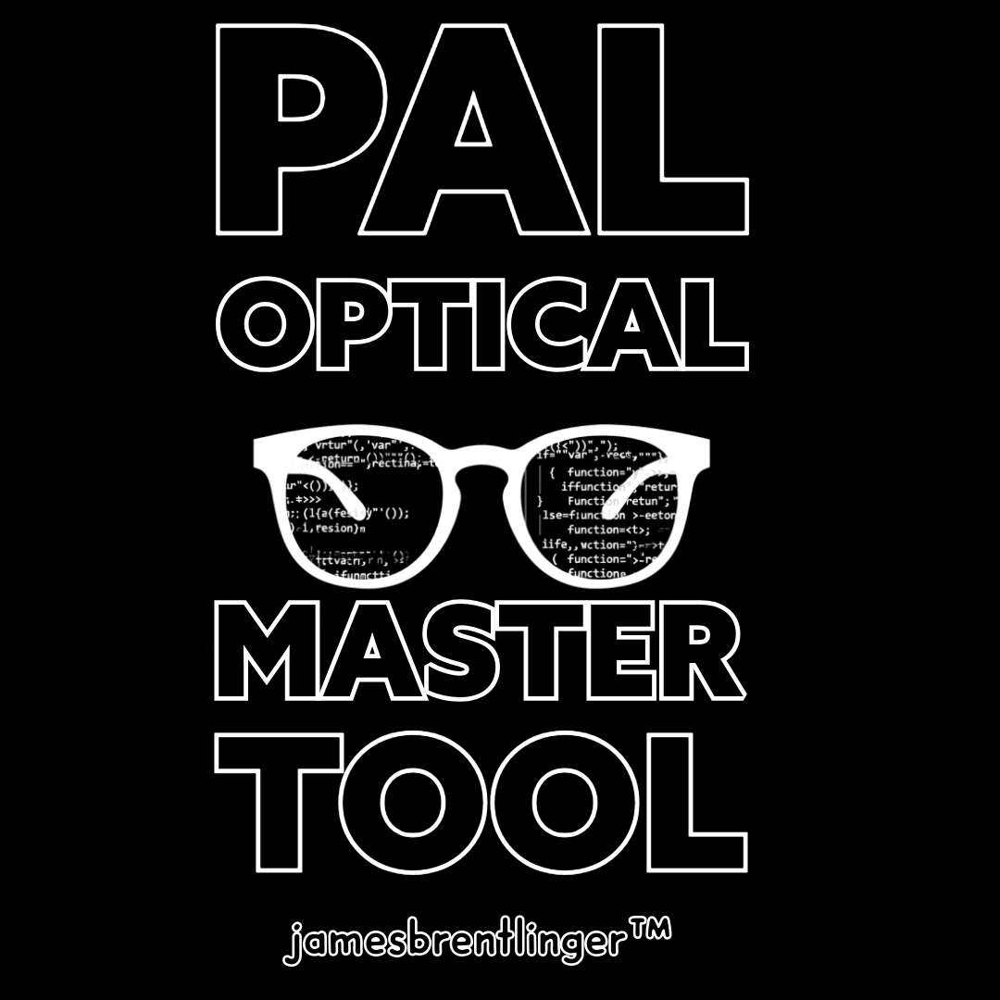

# 🔬 Pal Optical Master Application

### A Comprehensive HTML-Based Optical Lab & Retail Management Suite

[](https://developers.google.com/web/progressive-web-apps)
[](LICENSE)
[](https://github.com/jbrentlinger/PALHTML/releases)


_A powerful, offline-capable suite of optical retail and lab management tools
built with HTML, CSS, and JavaScript_

---



---

## 📋 Table of Contents

- [🌟 Overview](#-overview)
- [🚀 Applications](#-applications)
- [⭐ P.O.S.T. Write-Up System - Deep Dive](#-post-write-up-system---deep-dive)
  - [Key Features](#key-features)
  - [User Authentication](#-user-authentication)
  - [Patient Management](#-patient-management)
  - [Insurance Integration](#-insurance-integration)
  - [Billing & Payments](#-billing--payments)
  - [Camera Measurement Tool](#-camera-measurement-tool)
  - [Lens Catalog](#-lens-catalog)
  - [Digital Signatures](#-digital-signatures)
  - [Print & Export](#-print--export)
  - [Real-Time Validation](#-- [🔧 Technical Stack](#-technical-stack)
    -real-time-validation) [📦 Installation](#-installation)
- [🎯 Features](#-features)
- [🔐 Security](#-security)
- [🤝 Contributing](#-contributing)
- [📄 License](#-license)
- [👨‍💻 Author](#-author)

---

## 🌟 Overview

**Pal Optical Master Application (POMA)** is a comprehensive, browser-based
optical lab management suite developed by James Brentlinger for Pal Optical in
Lexington, KY. This powerful application provides a complete digital workflow
for optical retail stores, from patient write-ups to lab orders and frame
inventory management.

### Key Highlights

| Feature                         | Description                                              |
| ------------------------------- | -------------------------------------------------------- |
| 🖥️ **Pure HTML/CSS/JavaScript** | No backend required for core functionality               |
| 📱 **PWA-Ready**                | Installable as a native app on any device                |
| 🌙 **Dark/Light Theme**         | Built-in theme switching support                         |
| 🔌 **Offline Capable**          | Works without internet (with Service Worker)             |
| 🖨️ **Print-Optimized**          | Generate professional receipts and waivers               |
| 📊 **Integrated Billing**       | Complete insurance and payment processing                |
| 🔒 **Secure**                   | Firebase-backed data synchronization with authentication |

---

## 🚀 Applications

The Pal Optical Master Suite includes **8 powerful applications**:

| #   | Application             | Description                                                                                 | File                       |
| --- | ----------------------- | ------------------------------------------------------------------------------------------- | -------------------------- |
| 1   | **P.O.S.T. Write-Ups**  | Advanced digital write-up system with Firebase sync, patient forms, and camera measurements | `WRITEUP.html`             |
| 2   | **Contact Lens Orders** | Manage and track patient contact lens orders                                                | `contact.html`             |
| 3   | **Detailed Receipt**    | Generate itemized receipts for optical services                                             | `PAL OPTICAL RECEIPT.HTML` |
| 4   | **Lab FSV Order Sheet** | Order Vision Ease FSV lenses directly from the lab                                          | `LABLENS.HTML`             |
| 5   | **Lens Availability**   | RX Ranges database for Progressives and Multifocals                                         | `lensavail.html`           |
| 6   | **Quote Tool**          | Professional estimates for lenses and frames                                                | `PALQUOTE (1).HTML`        |
| 7   | **Frame Inventory**     | Full-service frame inventory management system                                              | `TracyFrameInventory.html` |
| 8   | **DR Itemized Receipt** | Professional receipts for doctor services                                                   | `DRITEMIZEDRECPT.HTML`     |

---

## ⭐ P.O.S.T. Write-Up System - Deep Dive

The **P.O.S.T. (Pal Optical Slip Tool)** is the flagship application of this
suite. It's a complete digital replacement for traditional paper write-ups,
featuring real-time synchronization, automated calculations, and professional
output generation.


### Key Features

#### 🔐 User Authentication

Secure login system with personalized access codes:

```
┌─────────────────────────────────────────────────────────┐
│  Available Users:                                       │
│  • JAMES (JB) - Master Admin                           │
│  • LINDA (LG) - Manager                               │
│  • APRIL (AB) - Optician                              │
│  • NAEROBI (NG) - Optician                            │
│  • SABRINA (SJ) - Optician                            │
│  • TRACY (TH) - Optician                              │
│  • CARRIBYAN (CWR) - Optician                         │
│  • MIRANDA (MS) - Optician                            │
│  • DRR - Doctor Access                                │
│  • DRK - Doctor Access                                │
│  • ROB (RH) - Staff                                   │
│  • LISA (LW) - Staff                                  │
└─────────────────────────────────────────────────────────┘
```

#### 📋 Patient Management

- **New Patient Information Sheets** with multi-language support:
  - 🇺🇸 **English**
  - 🇪🇸 **Español** (Spanish)
  - 🇫🇷 **Français** (French)
- **HIPAA Consent Tracking**
- **Guardian Information** for minor patients
- **Insurance Details** capture
- **Patient History** with one-click reload

#### 💳 Insurance Integration

Comprehensive insurance processing with support for:

| Insurance Provider | Type                                                       |
| ------------------ | ---------------------------------------------------------- |
| Private Pay / None | Cash                                                       |
| MEDICAID           | Multiple types (Aetna, Humana/Eyequest, Regular, Wellcare) |
| EYE-MED            | Commercial                                                 |
| AETNA EYE-MED      | Commercial                                                 |
| PREMIER VISION     | Commercial                                                 |
| MARCH/EYESYNERGY   | Commercial                                                 |
| UNUM               | Commercial                                                 |
| NVA                | Commercial                                                 |
| VBA                | Commercial                                                 |
| VSP                | Commercial                                                 |
| SPECTERA           | Commercial                                                 |
| SCHOOL LETTER      | Lexington, KY school district program                      |

**Insurance Features:**

- ✅ **Allowance Plans** - Automatic deduction calculations
- ✅ **Copay Processing** - Patient responsibility calculation
- ✅ **20% Frame Discount** - Auto-applied for VSP/Eye-Med frame-only or
  lens-only orders
- ✅ **Medicaid Billing Codes** - 92340, 92370, Prior Auth support

#### 💰 Billing & Payments

Complete billing table with automatic calculations:

| Item        | Retail | Retail + Tax | Patient Total |
| ----------- | ------ | ------------ | ------------- |
| Frame       | ✓      | ✓            | ✓             |
| Lens        | ✓      | ✓            | ✓             |
| A/R Coating | ✓      | ✓            | ✓             |
| Misc 1      | ✓      | ✓            | ✓             |
| Misc 2      | ✓      | ✓            | ✓             |
| Misc 3      | ✓      | ✓            | ✓             |

**Payment Methods:**

- 💵 **Cash**
- 💳 **Credit/Debit Cards** (Visa, MC, Discover, AMEX)
- 💳 **HSA/FSA Cards**
- 📝 **Check** (with check number)

#### 📷 Camera Measurement Tool

Revolutionary PD and Seg Height measurement using your device camera:

```
┌────────────────────────────────────────────────────┐
│         CAMERA MEASUREMENT PROCESS                │
├────────────────────────────────────────────────────┤
│  Step 1: Click LEFT edge of credit card            │
│     ↓                                             │
│  Step 2: Click RIGHT edge of credit card          │
│     ↓                                             │
│  Step 3: Click center of RIGHT pupil              │
│     ↓                                             │
│  Step 4: Click center of LEFT pupil               │
│     ↓                                             │
│  Step 5: Click BOTTOM of right lens (Seg)         │
│     ↓                                             │
│  Result: Instant PD & Seg Height Display          │
└────────────────────────────────────────────────────┘
```

- 📸 **Credit Card Calibration** - Uses standard ID-1 credit card (85.60mm) for
  scale
- 🎯 **5-Point Measurement Process**
- ⚡ **Real-time Calculations** - Instant PD and Seg Height display
- 💾 **Save to Form** - Automatic population of measurements

#### 🔍 Lens Catalog

Extensive lens database with **400+ lens options** including:

| Category                 | Popular Options                                                                        |
| ------------------------ | -------------------------------------------------------------------------------------- |
| **Plastic (CR-39)**      | Plano, Single Vision, Flat Top 28/35, Varilux Comfort, Varilux X, Shamir Autograph III |
| **Polycarbonate**        | Single Vision, Flat Top 28, Varilux, Shamir, Unity Via                                 |
| **Trivex**               | Single Vision, Eyezen, Flat Top 28, Varilux Comfort                                    |
| **High-Index 1.67/1.74** | Single Vision, Flat Top, Progressive                                                   |
| **Glass**                | Single Vision, FT-28, Freefocus HD                                                     |
| **Transitions**          | All materials with light adaptation                                                    |
| **Polarized**            | KBCO, Younger Image, Essilor Natural                                                   |
| **Drivewear**            | Driving-specific lenses                                                                |
| **Office/Computer**      | Freefocus PC, Shamir Workspace, Zeiss Officelens                                       |
| **Ray-Ban**              | Branded lenses with Blue Light & Transitions                                           |

**Pricing Features:**

- 🔍 Automatic price lookup from master database
- 🏥 Insurance-specific pricing (Medicaid = $0.00)
- 💵 Copay/Allowance prompts for commercial insurance
- ⚙️ Automatic miscellaneous charges:
  - Oversize lenses (eyesize ≥58mm)
  - High prescriptions (≥±4.00, ≥±8.00)
  - High add powers (≥+3.00, ≥+4.00)
  - Prism prescriptions

#### ✍️ Digital Signatures

| Feature               | Description                |
| --------------------- | -------------------------- |
| 👆 **Touch-Friendly** | Works with finger/stylus   |
| 🔄 **Clear & Redo**   | Reset signature anytime    |
| 📸 **Auto-Capture**   | Automatic for print output |
| 💾 **Canvas Storage** | High-quality image storage |

#### 🖨️ Print & Export

Multi-page print output generation:

```
┌─────────────────────────────────────────────────────────┐
│                    PRINT OUTPUT                         │
├─────────────────────────────────────────────────────────┤
│  📄 Page 1: Dual Slip Page                             │
│     • Perforated lab slips (Store + Lab copies)        │
│                                                         │
│  📋 Page 2: Patient Information Sheet                  │
│     • Multi-language form (EN/ES/FR)                   │
│     • Demographics & Insurance                         │
│     • HIPAA Consent & Signature                        │
│                                                         │
│  ⚠️ Page 3: Waiver/Disclosure Form                    │
│     • Auto-generated based on checkboxes               │
│     • Expired Rx, POF, Thickness, Poly, etc.           │
│                                                         │
│  💾 Auto-Save: HTML files to local folder             │
│     • Patient name, Job #, Timestamp                   │
└─────────────────────────────────────────────────────────┘
```

**Available Waivers:**

- ❌ Expired Rx Waiver
- 👓 Patient Own Frame (POF) Waiver
- 📏 Frame Thickness Waiver
- 👶 Child Polycarbonate Waiver
- 🔄 Lined to No-Line Waiver
- 🔧 Semi-Rimless Chip Waiver
- 🔄 Remake Request Form

#### ✅ Real-Time Validation

Intelligent form validation:

- 🎯 Tracks required fields based on job type
- 🚫 Disables print button until complete
- 📢 Shows validation messages in real-time
- 🔄 Supports job type switching (Complete/Frame Only/Lens Only)

---

## 🔧 Technical Stack

| Technology            | Usage                                   |
| --------------------- | --------------------------------------- |
| **HTML5**             | Semantic markup, offline capabilities   |
| **CSS3**              | Styling, animations, print styles       |
| **JavaScript (ES6+)** | Application logic, Firebase integration |
| **Firebase**          | Real-time database, authentication      |
| **Service Worker**    | PWA offline functionality               |
| **Local Storage**     | Data persistence, settings              |
| **Canvas API**        | Signature capture, measurements         |

### Browser Support

| Browser                | Status         |
| ---------------------- | -------------- |
| 🟦 Chrome/Edge         | ✅ Recommended |
| 🟧 Firefox             | ✅ Supported   |
| 🟦 Safari              | ✅ Supported   |
| 📱 Mobile Safari (iOS) | ✅ Supported   |
| 📱 Chrome for Android  | ✅ Supported   |

---

## 📦 Installation

### Quick Start (Local)

```
bash
# Clone or download this repository
git clone https://github.com/jbrentlinger/PALHTML.git
cd PALHTML

# Open index.html in your preferred browser

# Windows
start index.html

# macOS
open index.html

# Linux
xdg-open index.html
```

### PWA Installation

For full offline capability:

```
bash
# Using Python
python -m http.server 8000

# Using Node.js
npx serve
```

Then open in browser and install:

- **Chrome/Edge**: Click install icon in address bar
- **iOS**: Share → Add to Home Screen
- **Android**: Menu → Install App

---

## 🎯 Features

### Core Features

| Icon | Feature                              |
| ---- | ------------------------------------ |
| ⭐   | P.O.S.T. Digital Write-Up System     |
| 📊   | Real-Time Billing Calculations       |
| 🏥   | Insurance Processing (10+ providers) |
| 📷   | Camera-Based Measurements            |
| 🌍   | Multi-Language Support (EN/ES/FR)    |
| 🌙   | Dark Mode Support                    |
| 📋   | Digital Waivers & Disclosures        |
| 💾   | Auto-Save to Local Folder            |
| 🔄   | Firebase Cloud Sync                  |
| 📱   | Responsive Design                    |
| 🖨️   | Professional Print Output            |
| 📚   | Lens Catalog Database (400+ items)   |

### Advanced Features

- 📋 Job Type Selection (Complete/Frame Only/Lens Only)
- 🔢 Automatic Rx Calculations
- 🔄 Remake Request Processing
- 📜 Patient History Tracking
- ⚙️ Pre-Adjustment Prompts
- ⏰ Time Promised Tracking (Call/Text/Mail/Time)
- 💰 Frame Allowance Calculations
- 🏷️ 20% Discount Auto-Application

---

## 🔐 Security

### Authentication

- 🔑 Unique user credentials per staff member
- ⚠️ Failed attempt tracking
- 🔒 Session-based access

### Data Protection

- 🔥 Firebase secure database
- 🔒 HTTPS transmission
- 💻 Local data encryption options

### Privacy

- 📋 HIPAA-compliant patient forms
- ✅ Consent tracking
- ✍️ Secure signature capture

---

## 🤝 Contributing

Contributions are welcome! Please feel free to submit a Pull Request.

### Development Setup

```
bash
# Fork the repository
# Create your feature branch
git checkout -b feature/AmazingFeature

# Commit your changes
git commit -m 'Add some AmazingFeature'

# Push to the branch
git push origin feature/AmazingFeature

# Open a Pull Request
```

---

## 📄 License

> **⚠️ IMPORTANT NOTICE**
>
> This software is proprietary and confidential. Unauthorized copying,
> distribution, or use of the materials, via any medium, is strictly prohibited.
>
> Copyright © 2024-2025 James Brentlinger, Pal Optical. All rights reserved.

---

## 👨‍💻 Author

|                  |                                                            |
| ---------------- | ---------------------------------------------------------- |
| **Name**         | James Brentlinger                                          |
| **Organization** | Pal Optical                                                |
| **Location**     | Lexington, KY                                              |
| **GitHub**       | [github.com/jbrentlinger](https://github.com/jbrentlinger) |

---

<div align="center">

### ⭐ Star this repository if you find it useful!

_Built with ❤️ for the optical industry_

</div>
