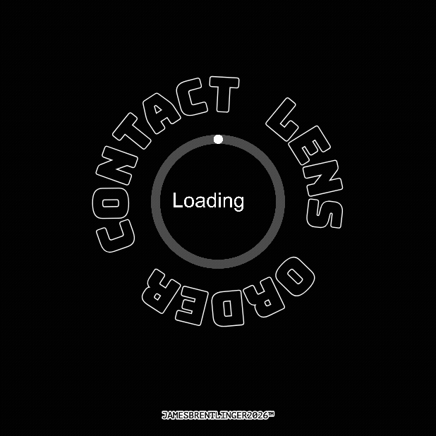
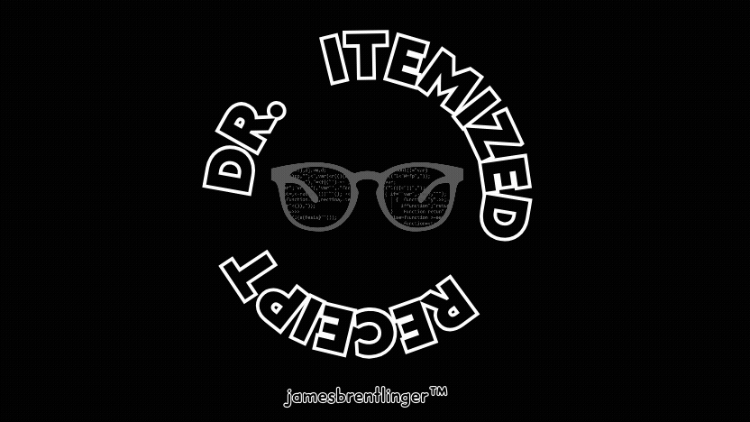
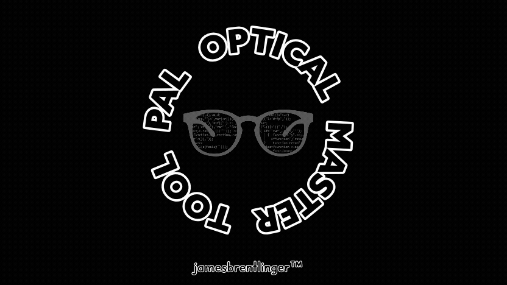
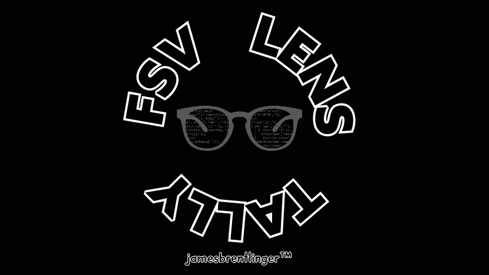
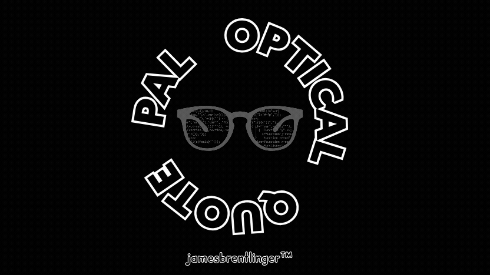
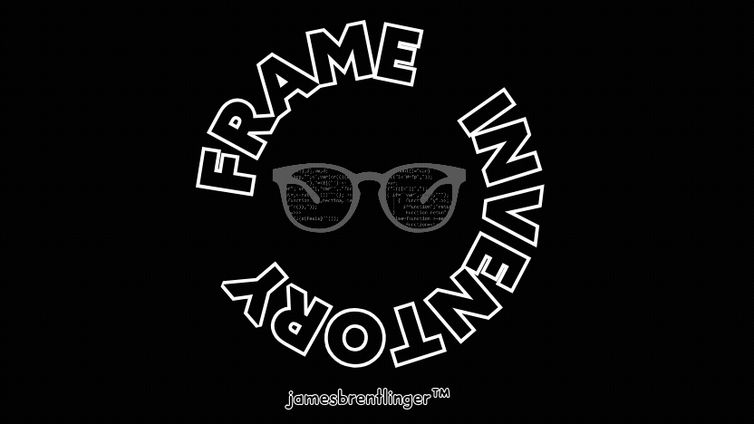
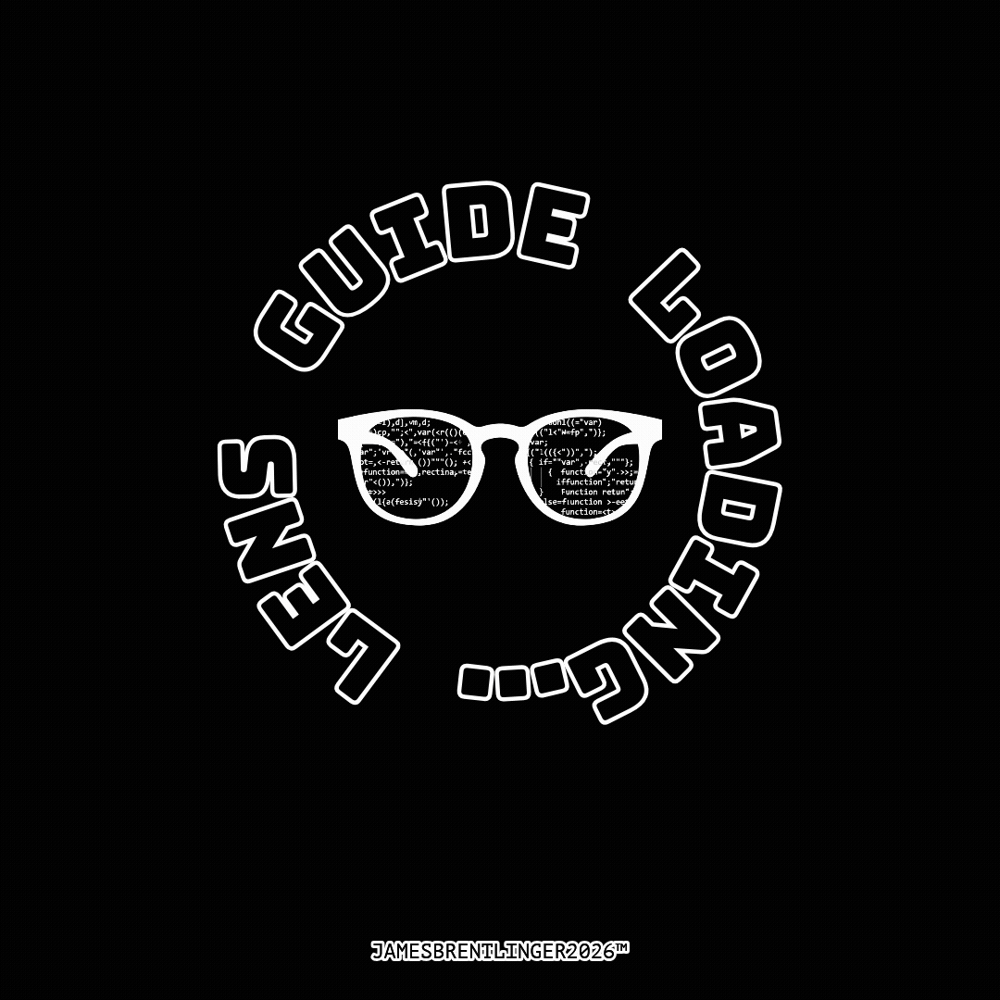

# 🔬 Pal Optical Master Application

### A Comprehensive HTML-Based Optical Lab & Retail Management Suite

[](https://developers.google.com/web/progressive-web-apps)
[](LICENSE)
[](https://github.com/jbrentlinger/PALHTML/releases)


_A powerful, offline-capable suite of optical retail and lab management tools
built with HTML, CSS, and JavaScript_

---


---

## 📋 Table of Contents

- [🌟 Overview](#-overview)
- [🚀 Applications](#-applications)
- [⭐ P.O.S.T. Write-Up System - Deep Dive](#-post-write-up-system---deep-dive)
  - [Key Features](#key-features)
  - [User Authentication](#-user-authentication)
  - [Patient Management](#-patient-management)
  - [Insurance Integration](#-insurance-integration)
  - [Billing & Payments](#-billing--payments)
  - [Camera Measurement Tool](#-camera-measurement-tool)
  - [Lens Catalog](#-lens-catalog)
  - [Digital Signatures](#-digital-signatures)
  - [Print & Export](#-print--export)
  - [Real-Time Validation](#-- [🔧 Technical Stack](#-technical-stack)
    -real-time-validation) [📦 Installation](#-installation)
- [🎯 Features](#-features)
- [🔐 Security](#-security)
- [🤝 Contributing](#-contributing)
- [📄 License](#-license)
- [👨‍💻 Author](#-author)

---

## 🌟 Overview

**Pal Optical Master Application (POMA)** is a comprehensive, browser-based
optical lab management suite developed by James Brentlinger for Pal Optical in
Lexington, KY. This powerful application provides a complete digital workflow
for optical retail stores, from patient write-ups to lab orders and frame
inventory management.

### Key Highlights

| Feature                         | Description                                              |
| ------------------------------- | -------------------------------------------------------- |
| 🖥️ **Pure HTML/CSS/JavaScript** | No backend required for core functionality               |
| 📱 **PWA-Ready**                | Installable as a native app on any device                |
| 🌙 **Dark/Light Theme**         | Built-in theme switching support                         |
| 🔌 **Offline Capable**          | Works without internet (with Service Worker)             |
| 🖨️ **Print-Optimized**          | Generate professional receipts and waivers               |
| 📊 **Integrated Billing**       | Complete insurance and payment processing                |
| 🔒 **Secure**                   | Firebase-backed data synchronization with authentication |

---

## 🚀 Applications - Complete Toolkit (10 Tools)

**Pal Optical Master Suite** - Pure HTML/JS, offline PWA for optical lab/retail.

| 🛠️ # | Tool                                            | Live Demo                                              | Status          |
| ---- | ----------------------------------------------- | ------------------------------------------------------ | --------------- |
| 1️⃣   | [P.O.S.T. Write-Ups](WRITEUP.html)              |                 | ⭐ **Flagship** |
| 2️⃣   | [Contact Lens Orders](contact.html)             |                 | 🟢 Live         |
| 3️⃣   | [Dr. Itemized Receipt](DRITEMIZEDRECPT.HTML)    |   | 🟢 Live         |
| 4️⃣   | [Master Dashboard](index.html)                  |                  | 🟢 Live         |
| 5️⃣   | [Pal Optical Receipt](PAL OPTICAL RECEIPT.HTML) |  | 🟢 Live         |
| 6️⃣   | [Lab FSV Order Sheet](LABLENS.HTML)             |                | 🟢 Live         |
| 7️⃣   | [Lens Availability](lensavail.html)             |     | 🟢 Live         |
| 8️⃣   | [Optician Calculator](opticalc.html)            | N/A                                                    | 🟢 Live         |
| 9️⃣   | [PAL Quote Tool](PALQUOTE (1).HTML)             |                  | 🟢 Live         |
| 🔟   | [Frame Inventory](TracyFrameInventory.html)     |     | 🟢 Live         |
| 1️⃣1️⃣ | [Lens Guide](lens-guide.html)                   |             | 🟢 Live         |

<details>
<summary>🔍 Click to expand: Feature Matrix (All Tools)</summary>

| Tool           | Key Features                                                               | Data                            | Output                                          |
| -------------- | -------------------------------------------------------------------------- | ------------------------------- | ----------------------------------------------- |
| **P.O.S.T.**   | Camera PD/Seg, 400+ lens catalog, Firebase sync, multi-lang forms, waivers | JSON pricing, Rx calc           | 3-page print (slips/forms/waivers), HTML export |
| **Contacts**   | Supply tracking, ins/payments                                              | LocalStorage                    | Excel export, print list                        |
| **Receipts**   | Dynamic items, ins adj, payments                                           | Live calc                       | Professional receipts                           |
| **Dashboard**  | PWA launcher, dark theme                                                   | Links all                       | N/A                                             |
| **Lens Avail** | RX ranges (50+ progs)                                                      | `Pal_Optical_Lens_Catalog.json` | Tables/search                                   |
| **Quote/Calc** | Estimates, thickness viz                                                   | Math engine                     | Quotes/calcs                                    |
| **Inventory**  | Frame mgmt                                                                 | Tracy-specific                  | Inventory reports                               |

</details>

**Live Demos**: Open `index.html` → Click any tool 🖱️

---

## ⭐ P.O.S.T. Write-Up System - Deep Dive

The **P.O.S.T. (Pal Optical Slip Tool)** is the flagship application of this
suite. It's a complete digital replacement for traditional paper write-ups,
featuring real-time synchronization, automated calculations, and professional
output generation.


### Key Features

#### 🔐 User Authentication

Secure login system with personalized access codes:

```

#### 📋 Patient Management

- **New Patient Information Sheets** with multi-language support:
  - 🇺🇸 **English**
  - 🇪🇸 **Español** (Spanish)
  - 🇫🇷 **Français** (French)
- **HIPAA Consent Tracking**
- **Guardian Information** for minor patients
- **Insurance Details** capture
- **Patient History** with one-click reload

#### 💳 Insurance Integration

Comprehensive insurance processing with support for:

| Insurance Provider | Type                                                       |
| ------------------ | ---------------------------------------------------------- |
| Private Pay / None | Cash                                                       |
| MEDICAID           | Multiple types (Aetna, Humana/Eyequest, Regular, Wellcare) |
| EYE-MED            | Commercial                                                 |
| AETNA EYE-MED      | Commercial                                                 |
| PREMIER VISION     | Commercial                                                 |
| MARCH/EYESYNERGY   | Commercial                                                 |
| UNUM               | Commercial                                                 |
| NVA                | Commercial                                                 |
| VBA                | Commercial                                                 |
| VSP                | Commercial                                                 |
| SPECTERA           | Commercial                                                 |
| SCHOOL LETTER      | Lexington, KY school district program                      |

**Insurance Features:**

- ✅ **Allowance Plans** - Automatic deduction calculations
- ✅ **Copay Processing** - Patient responsibility calculation
- ✅ **20% Frame Discount** - Auto-applied for VSP/Eye-Med frame-only or
  lens-only orders
- ✅ **Medicaid Billing Codes** - 92340, 92370, Prior Auth support

#### 💰 Billing & Payments

Complete billing table with automatic calculations:

| Item        | Retail | Retail + Tax | Patient Total |
| ----------- | ------ | ------------ | ------------- |
| Frame       | ✓      | ✓            | ✓             |
| Lens        | ✓      | ✓            | ✓             |
| A/R Coating | ✓      | ✓            | ✓             |
| Misc 1      | ✓      | ✓            | ✓             |
| Misc 2      | ✓      | ✓            | ✓             |
| Misc 3      | ✓      | ✓            | ✓             |

**Payment Methods:**

- 💵 **Cash**
- 💳 **Credit/Debit Cards** (Visa, MC, Discover, AMEX)
- 💳 **HSA/FSA Cards**
- 📝 **Check** (with check number)

#### 📷 Camera Measurement Tool

Revolutionary PD and Seg Height measurement using your device camera:

```

┌────────────────────────────────────────────────────┐ │ CAMERA MEASUREMENT
PROCESS │ ├────────────────────────────────────────────────────┤ │ Step 1: Click
LEFT edge of credit card │ │ ↓ │ │ Step 2: Click RIGHT edge of credit card │ │ ↓
│ │ Step 3: Click center of RIGHT pupil │ │ ↓ │ │ Step 4: Click center of LEFT
pupil │ │ ↓ │ │ Step 5: Click BOTTOM of right lens (Seg) │ │ ↓ │ │ Result:
Instant PD & Seg Height Display │
└────────────────────────────────────────────────────┘

```

- 📸 **Credit Card Calibration** - Uses standard ID-1 credit card (85.60mm) for
  scale
- 🎯 **5-Point Measurement Process**
- ⚡ **Real-time Calculations** - Instant PD and Seg Height display
- 💾 **Save to Form** - Automatic population of measurements

#### 🔍 Lens Catalog

Extensive lens database with **400+ lens options** including:

| Category                 | Popular Options                                                                        |
| ------------------------ | -------------------------------------------------------------------------------------- |
| **Plastic (CR-39)**      | Plano, Single Vision, Flat Top 28/35, Varilux Comfort, Varilux X, Shamir Autograph III |
| **Polycarbonate**        | Single Vision, Flat Top 28, Varilux, Shamir, Unity Via                                 |
| **Trivex**               | Single Vision, Eyezen, Flat Top 28, Varilux Comfort                                    |
| **High-Index 1.67/1.74** | Single Vision, Flat Top, Progressive                                                   |
| **Glass**                | Single Vision, FT-28, Freefocus HD                                                     |
| **Transitions**          | All materials with light adaptation                                                    |
| **Polarized**            | KBCO, Younger Image, Essilor Natural                                                   |
| **Drivewear**            | Driving-specific lenses                                                                |
| **Office/Computer**      | Freefocus PC, Shamir Workspace, Zeiss Officelens                                       |
| **Ray-Ban**              | Branded lenses with Blue Light & Transitions                                           |

**Pricing Features:**

- 🔍 Automatic price lookup from master database
- 🏥 Insurance-specific pricing (Medicaid = $0.00)
- 💵 Copay/Allowance prompts for commercial insurance
- ⚙️ Automatic miscellaneous charges:
  - Oversize lenses (eyesize ≥58mm)
  - High prescriptions (≥±4.00, ≥±8.00)
  - High add powers (≥+3.00, ≥+4.00)
  - Prism prescriptions

#### ✍️ Digital Signatures

| Feature               | Description                |
| --------------------- | -------------------------- |
| 👆 **Touch-Friendly** | Works with finger/stylus   |
| 🔄 **Clear & Redo**   | Reset signature anytime    |
| 📸 **Auto-Capture**   | Automatic for print output |
| 💾 **Canvas Storage** | High-quality image storage |

#### 🖨️ Print & Export

Multi-page print output generation:

```

┌─────────────────────────────────────────────────────────┐ │ PRINT OUTPUT │
├─────────────────────────────────────────────────────────┤ │ 📄 Page 1: Dual
Slip Page │ │ • Perforated lab slips (Store + Lab copies) │ │ │ │ 📋 Page 2:
Patient Information Sheet │ │ • Multi-language form (EN/ES/FR) │ │ •
Demographics & Insurance │ │ • HIPAA Consent & Signature │ │ │ │ ⚠️ Page 3:
Waiver/Disclosure Form │ │ • Auto-generated based on checkboxes │ │ • Expired
Rx, POF, Thickness, Poly, etc. │ │ │ │ 💾 Auto-Save: HTML files to local folder
│ │ • Patient name, Job #, Timestamp │
└─────────────────────────────────────────────────────────┘

```

**Available Waivers:**

- ❌ Expired Rx Waiver
- 👓 Patient Own Frame (POF) Waiver
- 📏 Frame Thickness Waiver
- 👶 Child Polycarbonate Waiver
- 🔄 Lined to No-Line Waiver
- 🔧 Semi-Rimless Chip Waiver
- 🔄 Remake Request Form

#### ✅ Real-Time Validation

Intelligent form validation:

- 🎯 Tracks required fields based on job type
- 🚫 Disables print button until complete
- 📢 Shows validation messages in real-time
- 🔄 Supports job type switching (Complete/Frame Only/Lens Only)

---

## 🔧 Technical Stack

| Technology            | Usage                                   |
| --------------------- | --------------------------------------- |
| **HTML5**             | Semantic markup, offline capabilities   |
| **CSS3**              | Styling, animations, print styles       |
| **JavaScript (ES6+)** | Application logic, Firebase integration |
| **Firebase**          | Real-time database, authentication      |
| **Service Worker**    | PWA offline functionality               |
| **Local Storage**     | Data persistence, settings              |
| **Canvas API**        | Signature capture, measurements         |

### Browser Support

| Browser                | Status         |
| ---------------------- | -------------- |
| 🟦 Chrome/Edge         | ✅ Recommended |
| 🟧 Firefox             | ✅ Supported   |
| 🟦 Safari              | ✅ Supported   |
| 📱 Mobile Safari (iOS) | ✅ Supported   |
| 📱 Chrome for Android  | ✅ Supported   |

---

## 📦 Quick Start

1. **Local**: `start index.html` (Windows) → Click any tool 🖱️
2. **PWA**: Serve → Install (offline/fullscreen)

```

# Live server (pick one)

npx serve . # Node.js python -m http.server 8000 # Python

````

**All tools work offline** after first load (Service Worker magic ✨).

---

## 🛠️ Detailed Tool Breakdown

### 1️⃣ P.O.S.T. Write-Ups (`WRITEUP.html`)


**Flagship Tool** - Complete digital replacement for paper slips (5000+ JS
lines).

| Feature        | Details                                         |
| -------------- | ----------------------------------------------- |
| 👥 **Users**   | 12 staff logins (James→Lisa) w/ initials        |
| 📋 **Forms**   | Multi-lang (EN/ES/FR), HIPAA, guardians         |
| 📷 **Camera**  | PD/Seg via credit card calibration (5 clicks)   |
| 💰 **Billing** | Auto lens pricing (400+), ins copays/allowances |
| 🏥 **Ins**     | Medicaid codes + 10 commercial (VSP 20% off)    |
| 🖨️ **Print**   | 3 pages: Dual slips + Pt sheet + Waivers        |
| ☁️ **Sync**    | Firebase realtime + local HTML export           |

<details><summary>🎥 Live Features (Click to expand)</summary>

```js
// Camera PD/Seg (Credit card = 85.6mm scale)
const CREDIT_CARD_WIDTH_MM = 85.6;
measurePixelsPerMM = pixDist / CREDIT_CARD_WIDTH_MM;
````

**Auto Charges**:

- Oversize (A≥58mm): +$20
- High Rx (±4/±8): +$10/$20
- High Add (+3/+4): +$15/$30
- Prism: +$10

**Lens Catalog Sample**: | Category | Examples | |----------|----------| |
Plastic | Varilux X ($530), Shamir III ($465) | | Poly | Unity VIA ($410),
Younger ($295) | | High Index | 1.67/1.74 SV ($365/$400) |

</details>

### 2️⃣ Contact Lens Orders (`contact.html`)


**Supply Tracking** - Annual/6mo/Custom boxes, ins/payments.

**Features**:

- ✅ Per-eye/total boxes
- ✅ Ins tracking (VSP/EyeMed)
- ✅ Payments: "Pay When Comes In" warnings
- 💾 **LocalStorage** persistence
- 📊 **Excel Export** (alphabetized)
- 🖨️ Print lists

**UI Highlights**:

```
Annual Supply | 6-Month | Custom Boxes (Per Eye?)
Payment: Cash/Card/Check/Ins/Pay Later ⚠️
```

### 3️⃣ Dr. Itemized Receipts (`DRITEMIZEDRECPT.HTML`)


**Dr. Klecker/Robbins** receipts w/ confirm modal.

**Key**:

- ➕ Dynamic item rows (Code/Desc/Qty/Price)
- 💰 Live totals: Subtotal - Ins Adj - Paid = Balance
- 🧾 Payments: Visa/MC/AmEx/Disc/Check/Cash
- ✅ **Date confirm** before print

### 4️⃣ Pal Optical Receipts (`PAL OPTICAL RECEIPT.HTML`)


**Pal-branded** version (same engine).

### 5️⃣ Master Dashboard (`index.html`)


**PWA Launcher** - Dark/light theme toggle.

```
P.O.S.T. | Contacts | Receipts | Calculator | ...
[🌙 Dark Mode] [Install PWA]
```

### 6️⃣ Lab FSV Order Sheet (`LABLENS.HTML`)


**Vision Ease FSV** lab orders.

### 7️⃣ Lens Availability (`lensavail.html`)


**RX Ranges** from `Pal_Optical_Lens_Catalog.json` (50+ progs).

**Sample**: | Lens | Material | SPH | CYL | ADD | Min Height |
|------|----------|-----|-----|-----|------------| | Varilux X | Plastic |
-10→+6 | →-6 | 0.75-3.50 | 14mm | | Shamir III | 1.67 | -16.75→+8.25 | →-8 |
0.75-4 | 17mm |

### 8️⃣ Optician Calculator (`opticalc.html`)

**Lens math** + thickness visualizer + retail tools.

### 9️⃣ PAL Quote Tool (`PALQUOTE (1).HTML`)


**Professional estimates**.

### 🔟 Frame Inventory (`TracyFrameInventory.html`)


**Full mgmt** for Tracy.

### 1️⃣1️⃣ Lens Viewing Guide (`lens-guide.html`)


**Interactive visualizer** (corridors/types).

</details>

## 🔧 Technical Stack

_Unchanged - Excellent_

## 🎯 Features

### Core Features

| Icon | Feature                              |
| ---- | ------------------------------------ |
| ⭐   | P.O.S.T. Digital Write-Up System     |
| 📊   | Real-Time Billing Calculations       |
| 🏥   | Insurance Processing (10+ providers) |
| 📷   | Camera-Based Measurements            |
| 🌍   | Multi-Language Support (EN/ES/FR)    |
| 🌙   | Dark Mode Support                    |
| 📋   | Digital Waivers & Disclosures        |
| 💾   | Auto-Save to Local Folder            |
| 🔄   | Firebase Cloud Sync                  |
| 📱   | Responsive Design                    |
| 🖨️   | Professional Print Output            |
| 📚   | Lens Catalog Database (400+ items)   |

### Advanced Features

- 📋 Job Type Selection (Complete/Frame Only/Lens Only)
- 🔢 Automatic Rx Calculations
- 🔄 Remake Request Processing
- 📜 Patient History Tracking
- ⚙️ Pre-Adjustment Prompts
- ⏰ Time Promised Tracking (Call/Text/Mail/Time)
- 💰 Frame Allowance Calculations
- 🏷️ 20% Discount Auto-Application

---

## 🔐 Security

### Authentication

- 🔑 Unique user credentials per staff member
- ⚠️ Failed attempt tracking
- 🔒 Session-based access

### Data Protection

- 🔥 Firebase secure database
- 🔒 HTTPS transmission
- 💻 Local data encryption options

### Privacy

- 📋 HIPAA-compliant patient forms
- ✅ Consent tracking
- ✍️ Secure signature capture

---

## 🤝 Contributing

Contributions are welcome! Please feel free to submit a Pull Request.

### Development Setup

```
bash
# Fork the repository
# Create your feature branch
git checkout -b feature/AmazingFeature

# Commit your changes
git commit -m 'Add some AmazingFeature'

# Push to the branch
git push origin feature/AmazingFeature

# Open a Pull Request
```

---

## 📄 License

> **⚠️ IMPORTANT NOTICE**
>
> This software is proprietary and confidential. Unauthorized copying,
> distribution, or use of the materials, via any medium, is strictly prohibited.
>
> Copyright © 2024-2025 James Brentlinger, Pal Optical. All rights reserved.

---

## 👨‍💻 Author

|                  |                                                            |
| ---------------- | ---------------------------------------------------------- |
| **Name**         | James Brentlinger                                          |
| **Organization** | Pal Optical                                                |
| **Location**     | Lexington, KY                                              |
| **GitHub**       | [github.com/jbrentlinger](https://github.com/jbrentlinger) |

---

<div align="center">

### ⭐ Star this repository if you find it useful!

_Built with ❤️ for the optical industry_

</div>
